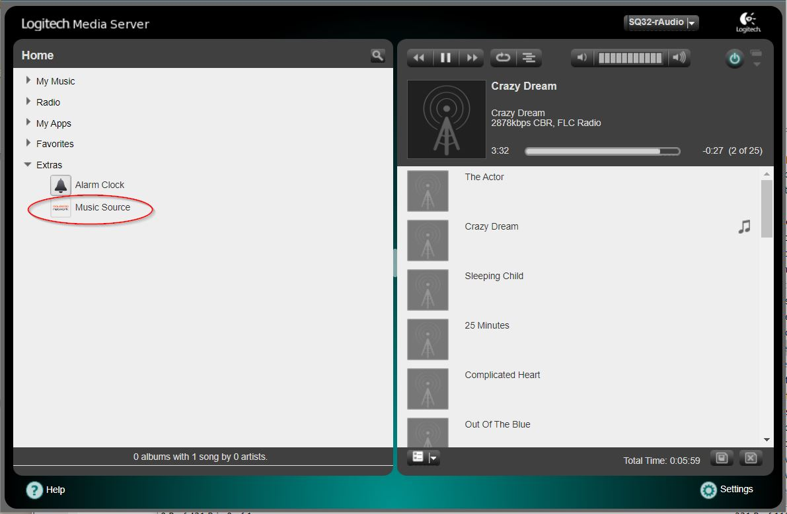
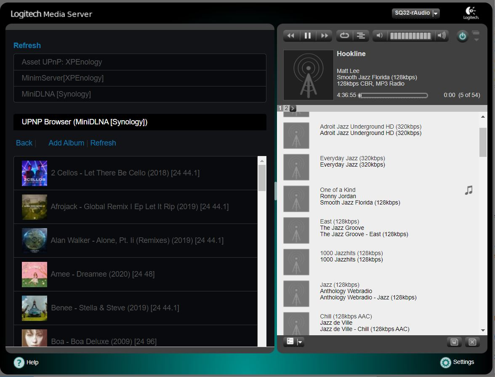

# LMSBub NAS for LMS-rAudio (ArchLinux)
>
1./ Install
> wget -O - https://raw.githubusercontent.com/lovehifi/lmsbub9/main/install.sh | sh
>
>
>
2./ WinSCP edit config (or nano edit): /srv/http/bub/config.inc.php
Change username, pass, URL server (Your Nas, Server...) in this file:
>
Change username, password, and connect URL (Your Nas, Server... like http://yourserver:58050) in this file:
> /srv/http/bub/config.inc.php
>
3. Go to the menu Extras, Music Source, choose Music and play.
------------------

### Another version of LMS-rAudio
>
at this [https://github.com/lovehifi/lmsbub](https://github.com/lovehifi/lmsbub).
>
### rAudio version is available [https://github.com/lovehifi/raudiobub](https://github.com/lovehifi/raudiobub).
