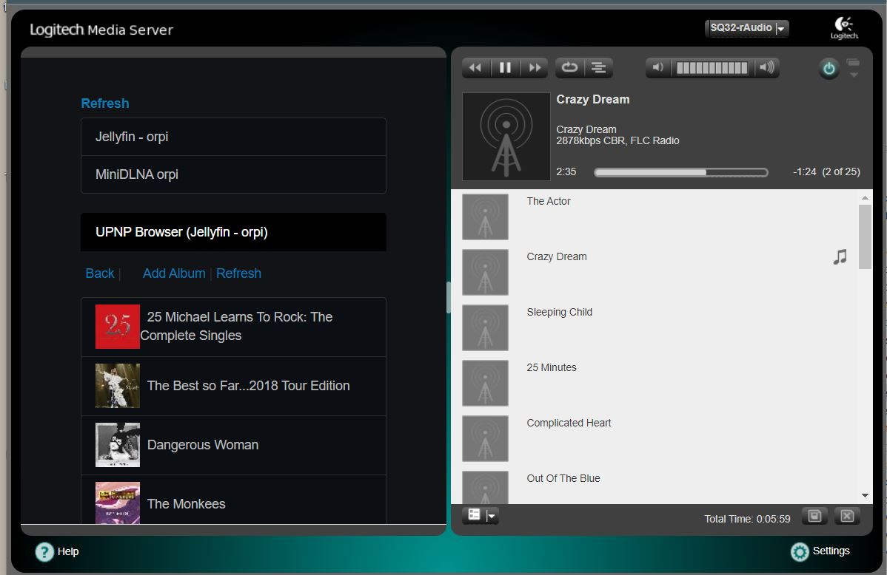

# LMSBub NAS for LMS-rAudio (ArchLinux)
>
Install
> wget -O - https://raw.githubusercontent.com/lovehifi/lmsbub9/main/install.sh | sh
>
------------------

### rAudio version is available [https://github.com/lovehifi/raudiobub](https://github.com/lovehifi/raudiobub).
